# Pixibot — Multi-Agent Software-Development System (Design)

> Status: **living design doc** (pre-implementation). No code yet by intent.
> Authors: the user + Claude (harness/MoA developers). The **TPM agent** is a
> third author at runtime — it writes projection instances (see §5).

---

## 0. Working principles

- **Decisions first, code later.** We agree on *what* and *why* before writing
  implementation. No 2k-line dumps.
- **De-obfuscation is a feature, not a habit.** Every design choice is stated
  with its tradeoff. This principle is also embodied *in the system itself* as
  the **Observer** agent (§4).
- This document is the running decision log. It is the source of truth.

---

## 1. Core mental model (the un-magic version)

A "multi-agent system" is not several programs. **An agent is one config passed
to the same loop:**

```
agent = (role system prompt) + (tool subset) + (model) + (budget) + (its own history)
```

The whole system is: instances of that primitive, coordinating over a shared
**blackboard** by **addressed messages**. "Delegation," "roles," and "MoA" are
all just ways of wiring this one primitive.

---

## 2. Architecture overview

```mermaid
flowchart TD
    U["Strict input<br/>(schema-valid request,<br/>produced by a pre-shaping LLM step)"] --> TPM

    TPM["TPM planning agent<br/>breakdown + assigns per-agent budgets<br/>{compute, depth, scope}"]
    TPM -->|emits| PROJ["Projection / JSON<br/>(validates against the grammar)"]
    PROJ -->|instantiates| MOA

    subgraph MOA["MoA team (materialized from the projection)"]
        direction TB
        TOPO["Topology / framework decider<br/>+ feature-handshake encoder"]
        LLD["LLD design + programming<br/>(per feature)"]
        PROG["Programmer<br/>(DP, libraries, clean impl,<br/>compiler-level optimization)"]
        TEST["Tester<br/>(validates interfaces/integration,<br/>asks for hooks, writes tests)"]
    end

    BB[("Blackboard<br/>SQLite append-only event log<br/>addressed msgs + derived state")]
    TOPO <--> BB
    LLD <--> BB
    PROG <--> BB
    TEST <--> BB

    CTX["Context-managing agent<br/>(watches log, drives activation,<br/>enforces scope)"] <--> BB
    OBS["Observer<br/>(time-series analyzer of the event log,<br/>diagrams + docs for final code review)"] --> BB

    MOA --> CP{"Checkpoint reached?"}
    CP -->|mechanical gate green → demo| USER["User feedback on demo"]
    USER -->|satisfied| DONE([Terminate])
    USER -->|revise| TPM
```



**Reading it:** a strict request → the TPM plans and **budgets** → its output is
a **projection/JSON** that **materializes the MoA** → the team coordinates over a
**blackboard** by **addressed messages** → at **checkpoints** a **demo** is
produced → **user feedback** is the termination gate.

---

## 3. Control model

- **No central per-step router.** Coordination is via the blackboard (§13).
- **Activation is message-driven.** An agent activates when an event **addressed
  to it** (`to_agent`) lands in its inbox (an event id beyond its cursor). This
  supersedes the earlier "watch a section for changes" model.
- **The context-managing agent drives it** — watches the event log, activates
  agents whose inbox has new messages, manages lifecycle, and **enforces scope**
  on writes.
- **Termination is human-gated:** checkpoints → mechanical gate → demo → user
  feedback. Satisfied ends the run; otherwise a revision cycle re-enters the TPM.

---

## 4. Agents

### Fixed harness agents (always present, NOT in the projection's `agents[]`)

| Agent | Job |
|---|---|
| **TPM** | Breakdown + planning; assigns `{compute, depth, scope}` budgets; emits the projection. |
| **Context-manager** | Watches the event log; drives message-driven activation; enforces scope; manages context/pruning; the **scheduler** of the lifecycle (§9). |
| **Observer** | Time-series analyzer of the event log; reconstructs *why a decision survived* via the message DAG; emits diagrams + docs to support a final full-codebase code review. |

### Variable work agents (composed per task by the TPM)

Specialists span **abstraction layers** (this is how "depth"/layers-of-abstraction
is realized — as distinct agents *and* a budget dimension):

| Agent | Layer | Job |
|---|---|---|
| **Topology / framework decider + handshake encoder** | System | Sets overall structure, library/framework choices, inter-feature interfaces. |
| **LLD design + programming (per feature)** | Component | Low-level design for an individual feature. |
| **Programmer** | Implementation | Craft: dynamic programming, best libraries, clean code, compiler-level optimization. |
| **Tester** | Verification | Validates every interface/integration; asks for hooks (classes, inputs); writes thorough tests. |

---

## 5. The core artifact — two layers

The projection/JSON is **the** artifact; it guides everything. It has two layers
with different authors:

| Layer | What | Author |
|---|---|---|
| **Grammar / schema** | The contract: allowed fields, agent types, budget dimensions. | **User + Claude** (fixed harness design) |
| **Projection instance** | A filled-in plan for one task; must validate against the grammar. | **TPM** (runtime) |

*We* define the shape of the box; the *TPM* fills it per request.

---

## 6. Strict input schema (draft)

The pre-shaping LLM conversation's job is to emit a **schema-valid** instance;
the harness rejects/repairs anything that isn't.

```jsonc
{
  "objective": "...",                    // the what, one clear statement
  "target": {                            // hard tech constraints, not suggestions
    "language": "...", "framework": "...", "platform": "..."
  },
  "constraints":   ["..."],              // hard rules: perf targets, no external deps, license
  "non_goals":     ["..."],              // explicit out-of-scope (bounds scope creep)
  "acceptance_criteria": ["..."],        // how "done" is judged — feeds demos + tester
  "review_cadence": "per-feature | per-milestone",   // how often you want a demo checkpoint
  "budget_ceilings": {                   // caps the USER sets; the TPM allocates within
    "compute":   "...",                  // total token/$ budget
    "max_depth": "junior | senior | principal",
    "scope":     "..."                   // e.g. single service, no infra changes
  }
}
```

> **Reconciliation:** the user sets budget *ceilings* here; the TPM distributes
> budget *per agent* within them. "User picks depth" lives as `max_depth` here.

---

## 7. Projection schema (draft)

What the TPM emits → instantiates the MoA.

```jsonc
{
  "plan_summary": "...",
  "breakdown": [ { "id": "f1", "desc": "...", "depends_on": [] } ],   // features/tasks + deps
  "blackboard_schema": { "sections": ["topology", "lld/f1", "impl/f1", "tests/f1"] },
  "agents": [                            // the VARIABLE team — generated per task
    {
      "id": "prog-f1",
      "role": "programmer",              // from the specialist set (§4)
      "budget": { "compute": 40000, "depth": "senior", "scope": "impl/f1" },
      "blackboard": { "reads": ["lld/f1", "topology"], "writes": ["impl/f1"] },
      "activates_on": "message to prog-f1"   // message-driven trigger
    }
  ],
  "checkpoints": [
    { "id": "cp1", "after": ["prog-f1", "test-f1"], "demo": "...", "gate": "user_feedback" }
  ]
}
```

---

## 8. Budgets & model mapping

The three budget dimensions must be **enforceable by the harness**, not vibes:

| Dimension | Meaning | Maps to |
|---|---|---|
| **compute** | How much the agent may spend | `effort` level + `max_tokens` + `task_budget` |
| **depth** | Which abstraction layers it reasons across | prompt scope + `effort` + **model tier** |
| **scope** | Which slice it owns | the blackboard `section` prefix it may read/write (enforced at the service) |

**Depth → model tier (locked):**

| Depth | Model |
|---|---|
| junior | Claude Sonnet 5 |
| senior | Claude Opus 4.8 |
| principal | Claude Opus 4.8 / Claude Fable 5 |

So "depth" turns three knobs at once: prompt scope, effort, and model tier.

---

## 9. Agent lifecycle & execution

**Unifying principle: agents are stateless; the blackboard is the state.** All
durable state lives on the blackboard (§13), so spawn/stop/resume are trivial —
there is no in-memory state to preserve.

### Lifecycle state machine (run by the context-manager)

```
SPAWNED(dormant) → ACTIVE(runs its own loop) → one of:
     ├─ DONE             (task slice complete)      → writes result, dormant
     ├─ BLOCKED          (needs data not on BB yet) → dormant, waits for a message
     ├─ BUDGET_EXHAUSTED (hit compute/depth cap)    → dormant, escalate to TPM
     └─ INTERRUPTED      (user revision / preempt)  → quiesce at step boundary
```

### Spawn — lazy, message-driven
An agent is instantiated when a message addressed to it appears — not eagerly at
plan time. No idle objects, no wasted context.

### Execute
An active agent runs its own loop (think → call tools → read/write blackboard)
until it hits a terminal state above.

### Context handling (locked)
- **Rebuilt from the blackboard on each activation, not held in memory.** On
  resume, context = role prompt + standards contract + budget + the blackboard
  slices it reads + its inbox since last cursor.
- **Prompt caching** keeps the re-read cheap: the stable prefix (role + standards)
  doesn't change between activations.
- **Isolation:** an agent sees only its own scratch context + the blackboard
  sections it is scoped to read — never the global transcript. The blackboard is
  shared memory; private context is scratch.

### Multi start/stop handling
- **Step-boundary checkpointing:** an agent writes progress to the blackboard
  after each sub-step, so a stop/interrupt loses *at most the in-flight step*.
  You never resume from RAM — you resume from the board.
- **Why start/stop happens:** blocked-on-data (unblocks on a message), budget-
  exhausted (escalates to TPM), preempted (user revision → global quiesce),
  iterative rework (Tester messages a failure → Programmer re-activates).

### Concurrency (locked)
`scope` is a **write lock by construction**: agents whose scope slices are
disjoint run in parallel (SQLite is transactional); agents with overlapping scope
are serialized by the context-manager.

### Interrupt / quiesce
A user revision at a checkpoint = global stop at step boundaries → snapshot →
feedback to the TPM → projection revised → agents re-activated.

---

## 10. Standards & enforcement

**Unifying principle: standards are versioned skill-docs for judgment + mechanical
gates for enforcement.** A standard written only into a prompt is *aspirational*.
**Prefer mechanical enforcement over prompt-adherence wherever a tool can check.**

### The split

| Kind | Lives as | Who applies it |
|---|---|---|
| **Judgment standards** (LLD structure, design taste, "no premature abstraction") | Versioned markdown in `standards/` — read on demand | The agents, via their prompts |
| **Mechanical standards** (style, types, coverage %, tests green) | Linters, formatters, type-checkers, test runners — run via `bash` in the container | The harness, as ground truth |

### The standards library
`standards/programming.md`, `standards/lld.md`, `standards/testing.md`,
`standards/best-practices.md` — versioned, authored by **user + Claude**. This is
the quality half of "defined by you and me," parallel to the schema.

### Injection (locked)
**Hybrid, progressive disclosure.** A short *standards contract* (a few lines)
sits in each agent's system prompt so the bar is always present; the *full* doc is
read on demand only when the agent needs it (the Skills pattern).

### Checkpoint gating (locked)
Checkpoints get a **mechanical gate before the human demo gate**: linters /
type-checks / tests / coverage must be green (mechanical) → *then* the demo goes
to the user. The user never reviews a demo that fails its own standards.

### Ownership & depth
- **Tester** enforces testing standards; tooling + a review pass enforce
  programming/LLD standards; **Observer** artifacts feed the final review.
- Standards apply **at the agent's abstraction layer** (same library, layer-filtered).

---

## 11. Runtime & execution environment

- **Docker container per run.** Work agents' `bash` / tests / builds execute
  *inside* the container; the container is the codebase workspace (the greenfield
  project is scaffolded there).
- **The blackboard lives host-side** (SQLite file on the host), so it survives the
  container and remains the durable record.
- **Container ↔ host boundary:** work agents reach the blackboard via the single
  **scope-enforcing blackboard service** (one port) on the host (§13). Chosen over
  a bind-mounted DB file specifically so scope can be enforced at the boundary.
- **One container + one blackboard DB per run.**
- **Greenfield-first.** Existing-codebase comprehension is explicitly deferred.

---

## 12. Interaction & steering

Two **orthogonal** concepts (people conflate them):

- **Cadence mode** = the run's default *pause policy* — when the whole run stops
  for you.
- **Direct agent talk** = a *targeted steering channel* — you address one agent,
  independent of mode.

### Cadence modes (locked: all three, per-run, switchable mid-run)

| Mode | Behavior |
|---|---|
| **hybrid** (default) | Autonomous between checkpoints; pauses at demos for your feedback. |
| **synchronous** | Checks in frequently, not just at checkpoints. |
| **asynchronous** | Runs unattended to completion (e.g. overnight); you review artifacts after. |

Switchable mid-run — drop into sync to babysit a tricky stretch, then back to async.

### Direct agent talk (locked)
You (and agents) address a specific agent by id/role; fixed agents are addressable
too ("Observer, explain why X").

- **Mechanism:** a `directive` (user→agent) or `message` (agent→agent) event on
  the blackboard, addressed via `to_agent`. Delivery reuses the lifecycle: target
  **dormant** → activates it; target **active** → read at its next **step
  boundary**; `urgent = 1` → interrupt at the next safe point.
- **Replies** are events addressed back (`to_agent = 'user'`) → surfaced to you.
- **Authority / escalation:** local directives → the agent obeys within its scope;
  directives that change scope/budget/plan → **escalate to the TPM** (same path as
  budget-exhaustion).
- Every directive is an event → **auditable by the Observer** for free.

### Spokesbot broker (talk without pausing) — implemented (M11)

Talking to an agent must never pause its work. The **Broker**
(`pixibot/interaction.py`) snapshots the target agent's context from the
blackboard up to now and spins a **cheap, read-only spokesbot** (Haiku —
cheapest per token; effort/adaptive-thinking off, which Haiku requires) briefed
with that snapshot to converse with the user. The working agent is untouched.
Steering stays separate and non-blocking: `tell()` posts a `directive` event the
agent consumes at its next step. The CLI (`pixibot/cli.py`, `python -m pixibot`)
is a chatbot over a run's blackboard — TPM by default, `@<id>` to talk to any
agent, `/tell` to steer, `/build` to plan+run. Offline (no key) it shows the
context snapshot; with a key each agent gets a live Haiku spokesperson.

---

## 13. Blackboard substrate & schema

**Decision: SQLite, behind a single scope-enforcing service (one port). Broker
deferred** — and *if* ever adopted, it must be a **durable stream** broker (Redis
Streams / Kafka / NATS JetStream), **never transient pub/sub** (which would blind
the Observer by dropping history). The backend sits behind an interface
(`send(from,to,payload)`, `poll_inbox(agent)`, `read_history()`), so it's a swap,
not a redesign.

**Principle: the `events` table is immutable / append-only** (the Observer's
history is sacred). Anything *mutable* — delivery cursors, agent runtime state —
lives in separate tables.

```sql
-- ── The blackboard: one append-only, IMMUTABLE event log ──────────────
CREATE TABLE events (
    id          INTEGER PRIMARY KEY AUTOINCREMENT,   -- monotonic order + the cursor key
    run_id      TEXT    NOT NULL,                     -- which run (one DB file per run; optional then)
    ts          TEXT    NOT NULL
                DEFAULT (strftime('%Y-%m-%dT%H:%M:%fZ','now')),  -- wall clock, for the Observer
    kind        TEXT    NOT NULL,                     -- 'artifact' | 'message' | 'directive' | 'control'
    from_agent  TEXT    NOT NULL,                     -- sender: agent id | 'user' | 'tpm' | 'context-manager'
    to_agent    TEXT,                                 -- recipient agent id | '*' (broadcast) | NULL (pure artifact)
    section     TEXT,                                 -- blackboard path: 'topology' | 'lld/f1' | 'impl/f1' ...
    payload     TEXT    NOT NULL,                     -- JSON or text: design, code, message body
    in_reply_to INTEGER REFERENCES events(id),        -- causal edge → builds the message DAG (Observer)
    urgent      INTEGER NOT NULL DEFAULT 0,           -- 1 = interrupt recipient at next safe point
    meta        TEXT                                  -- JSON: {tokens, model, effort, budget_spent, ...}
);

CREATE INDEX idx_inbox   ON events(to_agent, id);    -- fast per-agent inbox reads
CREATE INDEX idx_section ON events(section, id);      -- fast latest-per-section (current state)
CREATE INDEX idx_run     ON events(run_id, id);

-- ── Mutable state, kept OUT of the log ────────────────────────────────
-- Delivery tracking: how far each agent has read its inbox.
CREATE TABLE cursors (
    agent_id           TEXT PRIMARY KEY,
    last_seen_event_id INTEGER NOT NULL DEFAULT 0
);

-- Agent runtime registry (the lifecycle state from §9).
CREATE TABLE agents (
    agent_id TEXT PRIMARY KEY,
    role     TEXT,   -- 'programmer' | 'tester' | ...
    depth    TEXT,   -- junior | senior | principal
    model    TEXT,   -- resolved from depth (Sonnet/Opus/Fable)
    scope    TEXT,   -- section prefix it may write, e.g. 'impl/f1'  ← enforced on write
    state    TEXT,   -- SPAWNED | ACTIVE | BLOCKED | BUDGET_EXHAUSTED | INTERRUPTED
    budget   TEXT    -- JSON {compute, depth, scope}
);
```

**The two queries that make it behave like a blackboard + inbox:**

```sql
-- INBOX read (activation = "a message addressed to me arrived"):
SELECT * FROM events
WHERE to_agent = :me
  AND id > (SELECT last_seen_event_id FROM cursors WHERE agent_id = :me)
ORDER BY id;
-- ...then advance the cursor:
UPDATE cursors SET last_seen_event_id = :max_id WHERE agent_id = :me;

-- CURRENT STATE (latest artifact per section = the working codebase/designs):
CREATE VIEW current_state AS
SELECT e.* FROM events e
JOIN (SELECT section, MAX(id) AS mid
      FROM events WHERE kind='artifact' GROUP BY section) latest
  ON e.id = latest.mid;
```

**Requirement → served by:**

| Need | Served by |
|---|---|
| Addressed agent→agent | `from_agent` / `to_agent` |
| Activation ("msg for me arrived") | `idx_inbox` + `cursors` |
| Observer history + causal DAG | immutable log + `in_reply_to` |
| Current state / artifacts | `section` + `current_state` view |
| Scope-as-write-lock | `agents.scope` checked against `section` at the service before INSERT |
| Cost/budget tracking | `meta` |
| Interrupt vs wait | `urgent` |

**Schema defaults (adopted for v0):** one DB file per run (`blackboard-<run>.db`;
`run_id` retained but vestigial for single-run files, useful only for a shared
multi-run store); `payload` as `TEXT`; broadcast via `to_agent = '*'` supported.

---

## 14. Decision log

1. Hybrid MoA — role specialists + aggregation where multiple opinions help.
2. An agent = config over one shared loop (§1).
3. Observer is a first-class agent; de-obfuscation is built into the architecture.
4. All agents are reasoning agents (thinking on).
5. All workflows are dynamic.
6. Input = a pre-shaped requirement, held to a **strict schema** (§6).
7. **TPM** plans, breaks down, and assigns `{compute, depth, scope}` budgets.
8. TPM output = a **projection/JSON** that **instantiates the MoA** (team generated, not fixed).
9. Coordination substrate = **blackboard**; a **context-managing agent** drives it.
10. Specialists span abstraction layers (topology/handshake → LLD → programmer) + tester.
11. **Observer** = event-log time-series analyzer → diagrams/docs → final code review.
12. **Termination is human-gated:** checkpoints → mechanical gate → demo → user feedback.
13. Core artifact = **grammar (user+Claude) + projection instance (TPM)**.
14. User sets **budget ceilings**; TPM allocates per-agent within them.
15. **Activation is message-driven** (addressed event → inbox); context-manager drives it.
16. Fixed agents (TPM, Observer, Context-manager) live **outside** the projection's `agents[]`.
17. Agent lifecycle: SPAWNED → ACTIVE → {DONE | BLOCKED | BUDGET_EXHAUSTED | INTERRUPTED}; context-manager is the scheduler.
18. **Spawn is lazy + message-driven.**
19. **Isolation:** an agent sees only its own scratch + scoped blackboard reads; never the global transcript.
20. **Step-boundary checkpointing** makes stop/resume safe (lose ≤ 1 in-flight step).
21. **Standards library** `standards/{programming,lld,testing,best-practices}.md` — versioned, authored by user + Claude.
22. **Standards split** into judgment (skill-docs) vs mechanical (tools); **prefer mechanical**.
23. Standards applied **at the agent's abstraction layer**.
24. **Runtime = Docker container per run**; work agents execute inside; blackboard host-side; **greenfield-first** (existing-codebase deferred).
25. **Depth → model tier:** junior = Sonnet 5, senior = Opus 4.8, principal = Opus 4.8 / Fable 5.
26. **Cadence = three modes** (sync/async/hybrid), per-run and **switchable mid-run**.
27. **Direct agent talk:** user (and agents) address specific agents via `directive`/`message` events; delivery via inbox; `urgent` interrupts at next safe point.
28. **Directive authority:** local → obey within scope; scope/budget/plan-changing → escalate to TPM.
29. **Blackboard substrate = SQLite** behind a single **scope-enforcing service** (one port); broker deferred; if ever, durable stream only.
30. **`events` is immutable/append-only**; mutable state (`cursors`, `agents`) in separate tables.
31. **Agents are stateless**; context rebuilt from the blackboard each activation.
32. **Concurrency:** `scope` = write-lock; parallel where disjoint, serialized where overlapping (SQLite transactional).
33. **Standards injection = hybrid** progressive disclosure; **enforcement = mechanical gates** at checkpoints before the human demo.
34. **Schema defaults:** one DB file per run; `payload` TEXT (v0); broadcast `to_agent='*'` supported.
35. **Interaction layer (M11):** talking to an agent never pauses it — a Broker snapshots its blackboard context and spins a cheap read-only Haiku spokesbot for the chat; steering is a separate non-blocking `directive`. CLI is a chatbot (`python -m pixibot`): TPM default, `@<id>` addressing, `/tell`, `/build`.
36. **Multi-agent wiring (M12):** dependency-driven activation (an artifact write wakes the agents that read that section) drives handshakes; the **Engine** persists a run for build/resume/tell/revise; **revision** re-invokes the TPM and splices in new agents; a **markdown intake form** captures the strict input, with a **hard-development** flag routing principal agents to Claude Fable 5 at xhigh effort.
37. **Interface (M13):** Claude-Code-like REPL — ANSI console (banner, agent-colored labels, threaded spinner), **token streaming** for spokesbot chat in live mode, and **live per-agent build progress** via the context-manager `on_activation` hook. Colors/streaming activate on a TTY with a key set; degrades cleanly to plain text in pipes/tests.

---

## 15. Open questions

**Resolved during the build:**
- *Invalid projection* → **bounded repair loop** — implemented (`schema.obtain_valid`,
  used by `tpm.plan`).
- *Revision cycle* → decided: **re-invoke the TPM** with the prior projection +
  demo feedback + current blackboard. Decision recorded; the interactive
  demo/feedback loop is not yet wired into `run.run_pipeline` (see §16).

### Still needed from the user
1. A **first concrete reference project** to validate against a real run.
2. **Existing coding standards/style guides** to ingest, or keep authoring
   `standards/` fresh.

---

## 16. Status & next steps

**Implemented (M1–M10), all unit-tested (42 tests green), on `main`:** blackboard
(§13), context-manager (§9), input/projection schemas + repair loop (§6/§7),
agent runtime with a `Model` abstraction (§9), agent factory, TPM (§7),
orchestrator (§5), full offline pipeline (`pixibot/run.py`), Docker executor +
local fallback (§11), Observer (§11), mechanical checkpoint gate (§10), and the
chatbot CLI + spokesbot broker (§12, M11).

**Coded but not yet exercised:** the real-Claude path (`AnthropicModel`,
`anthropic_*` factories) — needs the `anthropic` SDK installed and
`ANTHROPIC_API_KEY`. Everything else runs offline against `MockModel`.

**Next wiring:**
- Human **checkpoint → demo → feedback → revision** loop into `run_pipeline`
  (the gate exists standalone; the pause/revise cycle isn't wired yet).
- **Multi-agent projections** with dependencies/handshakes beyond the
  single-agent demo (topology → LLD → programmer → tester).
- Build & use the **Docker image** for real tool execution.
- Deepen `standards/` and invoke the gate at each checkpoint.
- A **first reference project** for a real end-to-end run (§15).
```
